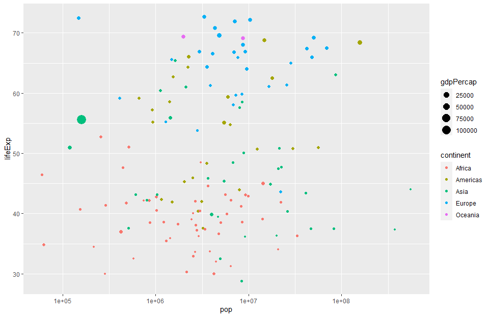
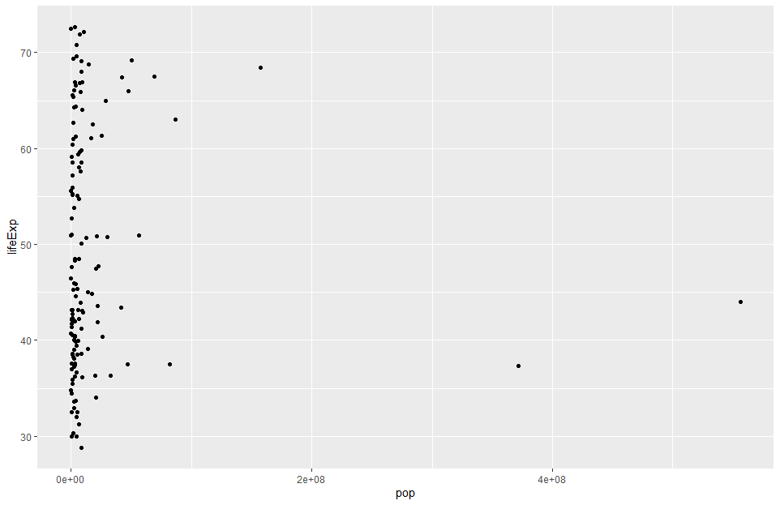
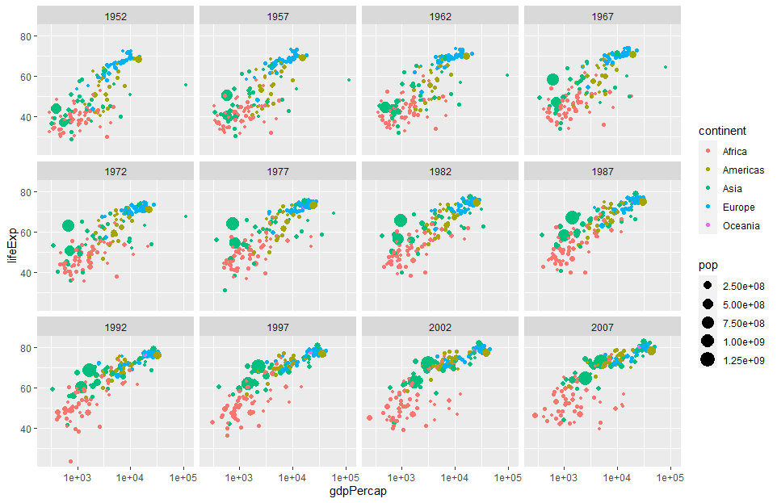
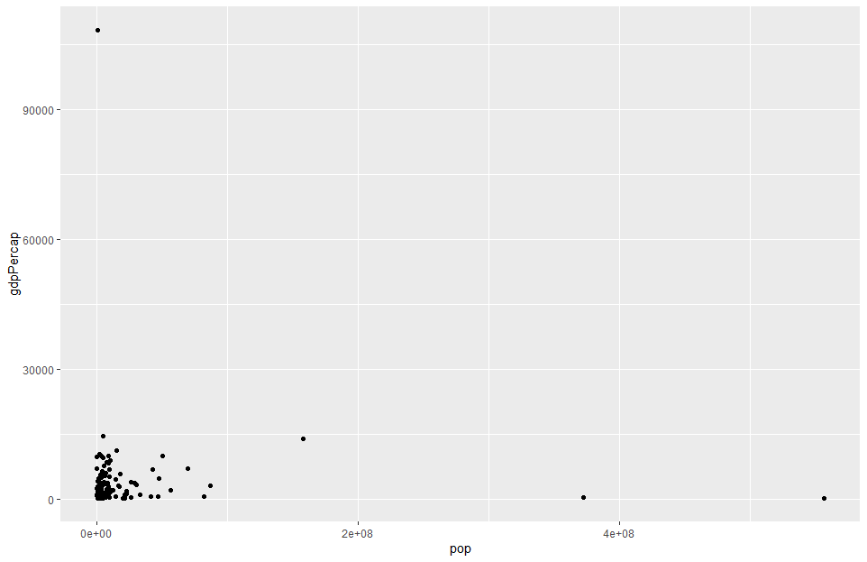

## Introduction to the Tidyverse


Data SET 
The `gapminder` data frames include six variables, ([Gapminder.org
documentation page](http://www.gapminder.org/data/documentation/)):

| variable  | meaning                  |
| :-------- | :----------------------- |
| country   |                          |
| continent |                          |
| year      |                          |
| lifeExp   | life expectancy at birth |
| pop       | total population         |
| gdpPercap | per-capita GDP           |

Per-capita GDP (Gross domestic product) is given in U.S. dollar.

### Install using the R package

Install `gapminder` from CRAN:

``` r
install.packages("gapminder")
```









